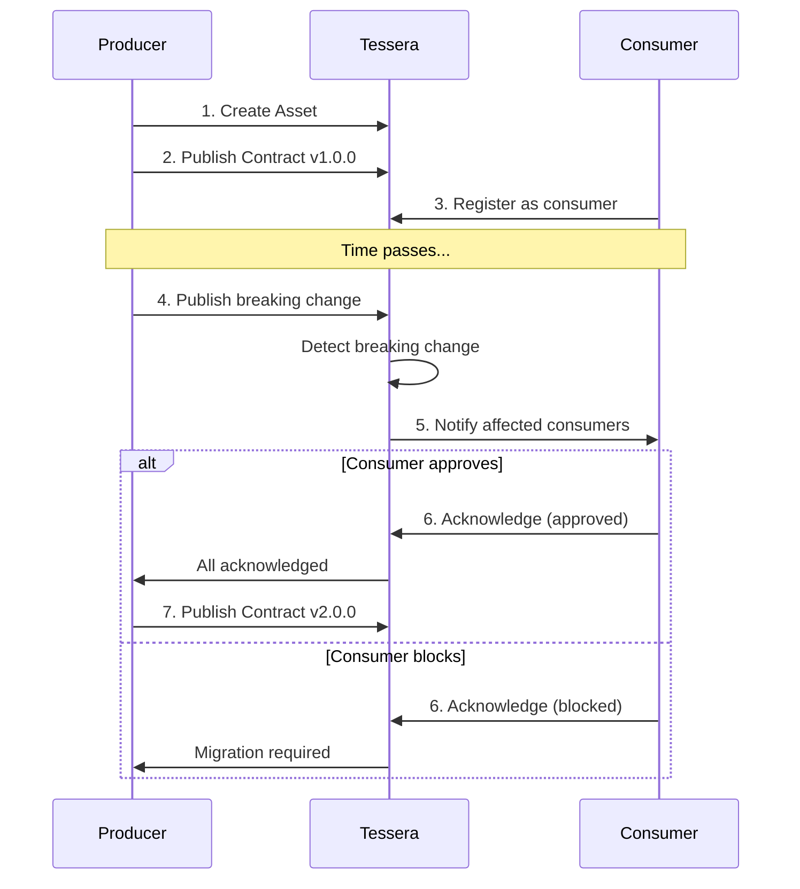

# Tessera

Data contract coordination for warehouses.

## The Problem

Data contracts tell you something is wrong. They don't tell you what to do about it.

The Kafka ecosystem solved producer/consumer coordination with schema registries. Warehouses have nothing equivalent. When a producer wants to drop a column, the workflow is tribal knowledge: Slack threads, Confluence pages, and hope.

## How It Works



**Producers** own assets and publish versioned contracts (JSON Schema + guarantees).

**Consumers** register dependencies on contracts they use.

**Breaking changes** create proposals that block until affected consumers acknowledge.

## Quick Start

```bash
# Install
uv sync --all-extras

# Configure
cp .env.example .env
# Edit DATABASE_URL

# Run migrations
alembic upgrade head

# Start server
uv run uvicorn tessera.main:app --reload

# Test
DATABASE_URL=sqlite+aiosqlite:///:memory: uv run pytest
```

## CLI

```bash
tessera team create "Analytics"
tessera asset create warehouse.core.users --team <team-id>
tessera contract publish --asset <id> --team <id> --version 1.0.0 --schema schema.json
tessera register --asset <id> --team <consumer-id>
tessera proposal acknowledge <id> --team <id> --response approved
```

Full reference: [docs/cli.md](docs/cli.md)

## API

All endpoints under `/api/v1`. Interactive docs at `/docs`.

| Resource | Endpoints |
|----------|-----------|
| Teams | CRUD + restore |
| Assets | CRUD + restore, dependencies, lineage |
| Contracts | Publish, list, diff, compare, impact analysis |
| Registrations | CRUD (consumer dependencies) |
| Proposals | List, acknowledge, withdraw, force, publish |
| Sync | Push/pull state, dbt manifest sync |
| Admin | API keys, webhooks, audit trail |

Full reference: [docs/api.md](docs/api.md)

## Compatibility Modes

| Mode | Breaking if... |
|------|----------------|
| `backward` | Remove field, add required, narrow type |
| `forward` | Add field, remove required, widen type |
| `full` | Any schema change |
| `none` | Nothing (notify only) |

## Configuration

| Variable | Description |
|----------|-------------|
| `DATABASE_URL` | PostgreSQL or SQLite connection string |
| `AUTH_DISABLED` | Skip auth for development (`true`/`false`) |
| `BOOTSTRAP_API_KEY` | Initial admin key for setup |
| `ENVIRONMENT` | `development` or `production` |
| `CORS_ORIGINS` | Allowed origins (comma-separated) |
| `REDIS_URL` | Redis for caching (optional) |

## Database

**PostgreSQL** (production): Full support with migrations via Alembic.

**SQLite** (development): `DATABASE_URL=sqlite+aiosqlite:///:memory:`

## Status

Early development.
